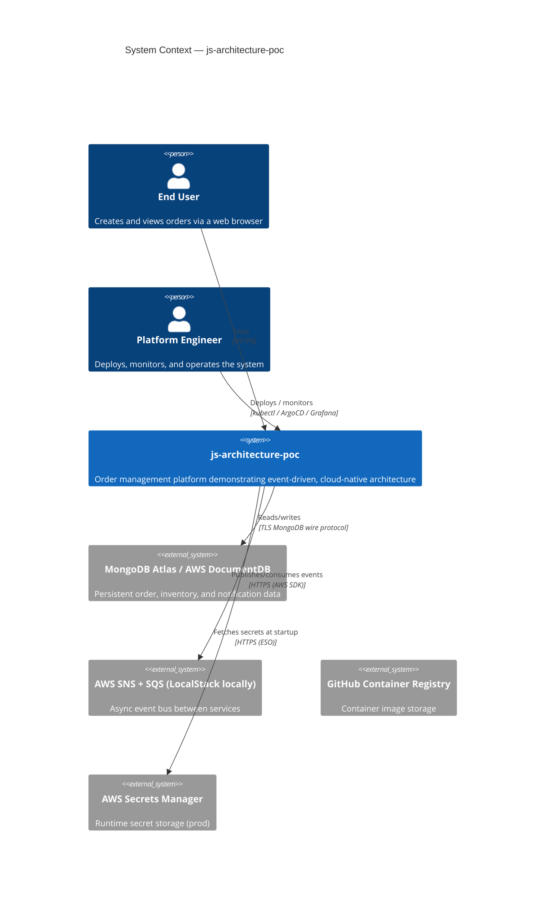
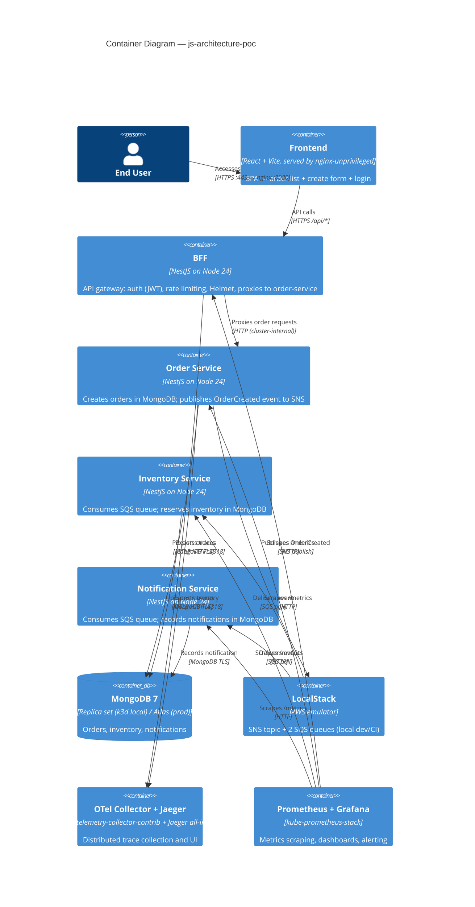
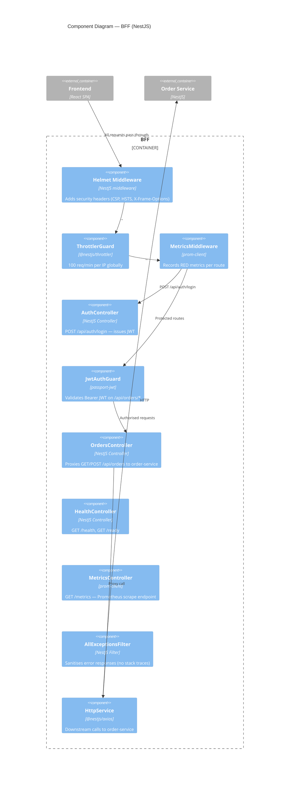
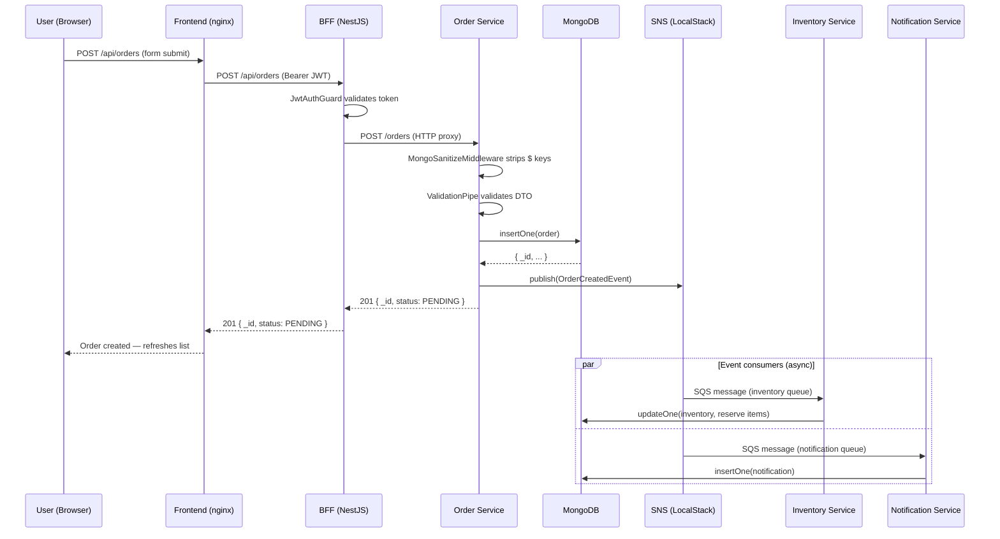
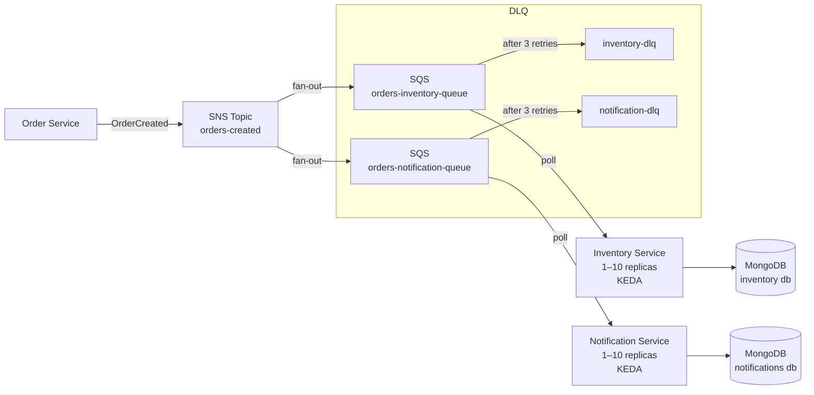

# Architecture Documentation

## Overview

This document describes the architecture of the `js-architecture-poc` — a fullstack,
event-driven, cloud-native application demonstrating production-grade patterns across
all layers of a modern web system.

---

## C4 Model Diagrams

### Level 1 — System Context

---

### Level 2 — Container Diagram

---

### Level 3 — Component Diagram (BFF)

---

## Data Flow Diagram

---

## Event Flow Diagram

---

## Local-to-Cloud Mapping

| Local (docker compose / k3d) | Production (AWS) | Notes |
|------------------------------|-----------------|-------|
| MongoDB 7 StatefulSet | AWS DocumentDB 5.0 | Connection string + TLS CA bundle differ |
| LocalStack SNS + SQS | AWS SNS + SQS | Only endpoint URL changes |
| k3d cluster | Amazon EKS (Terraform) | Same Kustomize manifests via overlays |
| Self-signed cert-manager CA | AWS ACM at ALB / Let's Encrypt | Ingress annotation changes |
| Sealed Secrets (local key) | External Secrets Operator + AWS Secrets Manager | ESO manifest in `k8s/base/sealed-secrets/` |
| Jaeger all-in-one | AWS X-Ray / Grafana Tempo | OTLP exporter endpoint changes |
| kube-prometheus-stack | Amazon Managed Prometheus + Grafana | Remote-write endpoint in Helm values |
| GHCR (CI push) | Amazon ECR | Image registry URL in kustomize overlay |
